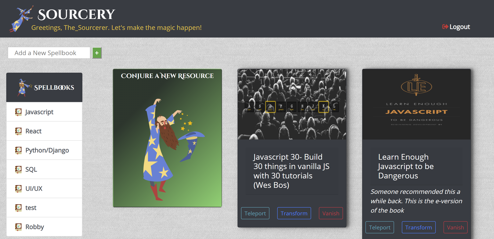
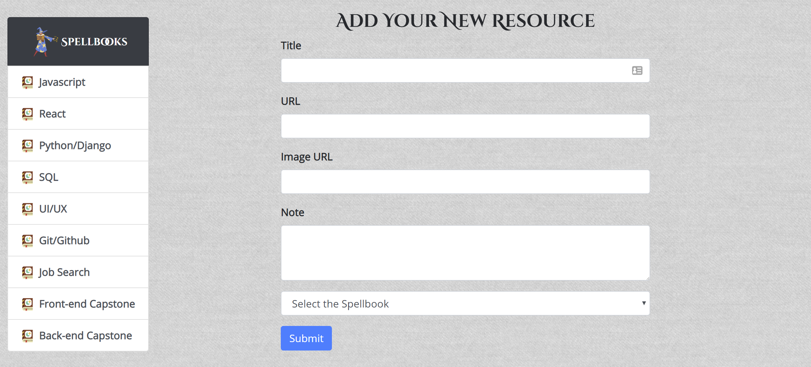
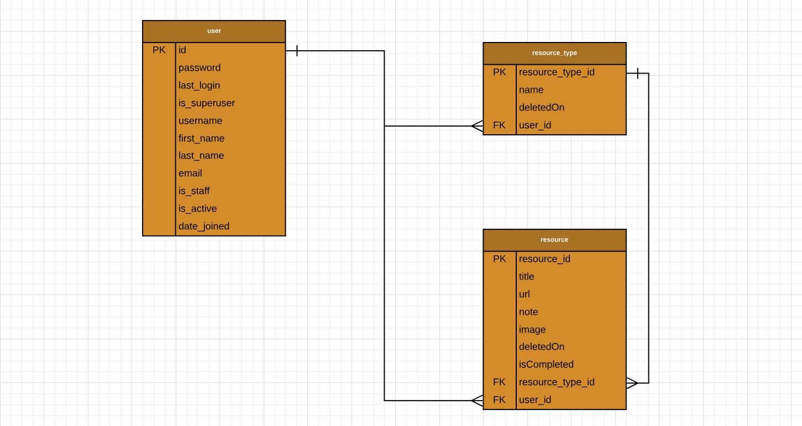

# Welcome to Sourcery developed by Dillon Williams

----
## What is Sourcery?

> Sourcery is a Django web-application created to aid in organizing your resources/bookmarks. As a student diving into the vast world of Software Development, I noticed my ever-growing list of folders and bookmarks were becoming more and more tedious to navigate through. Sourcery is here to to help resolve that issue. The idea was to give a clean user-interface that was easy to use but also had a fun design and feel to it. Users can register an account and add as many resource types/spellbooks as they would like and then create and assign resources (articles, videos, etc) to the resource types. The user has the ability to save notes and images associated with each resource to allow better organization and tracking. Within each resource card users can either teleport to (go to), transform (edit), or vanish (delete) the resource. The "front-end" is fully constructed utilizing Django's templating system. Sourcery is fully CRUD capable. Data stored in SQLite 3 database.

----
## What technologies went into the application?

>  Python | Django | SQLite 3 | Bootstrap

----






## Entity Relationship Diagram


# Installing Core Technologies

## 1. SQLite

### For OSX Users

```
brew install sqlite
```

### For Windows Users

Visit the [SQLite downloads](https://www.sqlite.org/download.html) and download the 64-bit DLL (x64) for SQLite version, unzip and install it.

## 2. SQL Browser

The [DB browser for SQLite](http://sqlitebrowser.org/) will let you view, query and manage your databases for this project.

## 3. Visual Studio Code

[Visual Studio Code](https://code.visualstudio.com/download) is Microsoft's cross-platform editor that you can use to view Python and Django code.

# Setting up environment and installing dependencies

## 1. Set up your virtual environment

Within the terminal, navigate to the location where you'd like to create the new environment and Sourcery project. Create a folder called Sourcery and navigate within the new folder. Then, enter this text to create the new environment:
```
virtualenv ENV
```
Then activate your environment:
```
source ENV/bin/activate
```
Note that you can type "deactivate" to end the new environment at any time.

## 2. Install Django

Within your new Sourcery folder (and with the virtual env activated), download Django by typing:
```
pip install django
```

## 3. Download the Sourcery project

Within your new Sourcery project folder, download the source code by typing:
```
git clone git@github.com:CosignMyCodesign/Sourcery.git
```

## 4. Starting the project server

After downloading the Sourcery project, you should have a new folder within the Sourcery Project folder that you created. The new folder will also be called sourcery.  Navigate within this folder.  Start the server by typing:
```
python manage.py runserver
```

## 5. Navigate to the Sourcery webpage

Within your web browser, navigate to http://localhost:8000/

From here, you should see the login / register view for the application.


# Creating the Sourcery DB

While inside the Sourcery/sourcery folder, enter this command:
```
python manage.py makemigrations sourcery
```
Then enter
```
python manage.py migrate
```
You now have a database named sqlite3.sql within your existing folder.  Use the DB Browser for SQLite to open the new database if desired.

# Credits
> Login/Auth cloned down from another school project (Instructors Joe Shephard and Steve Brownlee are shown as contributors for this)

